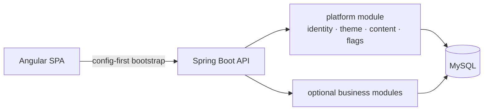

# VantageEngine
**White-label commerce engine — runtime-configurable identity, theme, content and modules**  
*Moves per-client branding, copy and feature switches from source code and environment variables into tenant-scoped data, so a new storefront is configuration, not a fork.*

-ED8B00?style=flat-square&logo=openjdk&logoColor=white)
-6DB33F?style=flat-square&logo=springboot&logoColor=white)
-DD0031?style=flat-square&logo=angular&logoColor=white)

---

### Overview
> Redesign of an earlier, single-client storefront whose brand, palette, navigation and feature toggles were hard-coded or driven by environment variables that required restarts. VantageEngine targets a modular monolith where identity, design tokens, page content and per-tenant feature flags are loaded from the database at startup. **The repository is in the planning stage: nothing below is implemented yet.**

---

### Key Engineering Decisions / Architecture
- **Config-first bootstrap:** the SPA resolves tenant identity, design tokens and enabled modules before rendering routes, instead of compiling them into the bundle.
- **Design tokens by role, not by colour:** CSS custom properties named by purpose (surface, accent, danger…) so a theme swap does not require renaming styles.
- **Feature flags with dependencies:** per-tenant flags stored in the database with a dependency graph (e.g. `checkout` requires `cart` requires `catalog`), cached and invalidated on change, replacing restart-bound environment switches.
- **Modular monolith:** Spring Modulith module boundaries with a light hexagonal layout per module, so optional business modules can be disabled or extracted without touching the platform core.
- **Clean-room rewrite:** the previous project is a functional reference only; no code is carried over.

---

### Tech Stack (planned — no build files in the repository yet)
| Layer | Technologies |
| :--- | :--- |
| **Backend** | `Java 21` · `Spring Boot` · `Spring Modulith` · `Spring Security` · `Flyway` |
| **Data** | `MySQL 8.4` |
| **Frontend** | `Angular` (standalone, Signals, lazy loading) · `CSS custom properties` |
| **Delivery** | `Docker` · `Docker Compose` |

---

### Status
| Item | State |
| :--- | :--- |
| Goals and architecture direction | Defined |
| Data model, modules, roadmap | In planning |
| Application code | Not started |

Case study of the predecessor project: [FerS00/portfolio](https://github.com/FerS00/portfolio).

---

### License
Source-available under the [PolyForm Noncommercial License 1.0.0](LICENSE) — not an OSI-approved open source license.

> Source code is available under the PolyForm Noncommercial License 1.0.0. Commercial use requires a separate license from the copyright holder.

Commercial use: [COMMERCIAL-LICENSE.md](COMMERCIAL-LICENSE.md).

Required Notice: Copyright (c) 2026 FerS00 (https://github.com/FerS00)

**Author:** [FerS00](https://github.com/FerS00)
