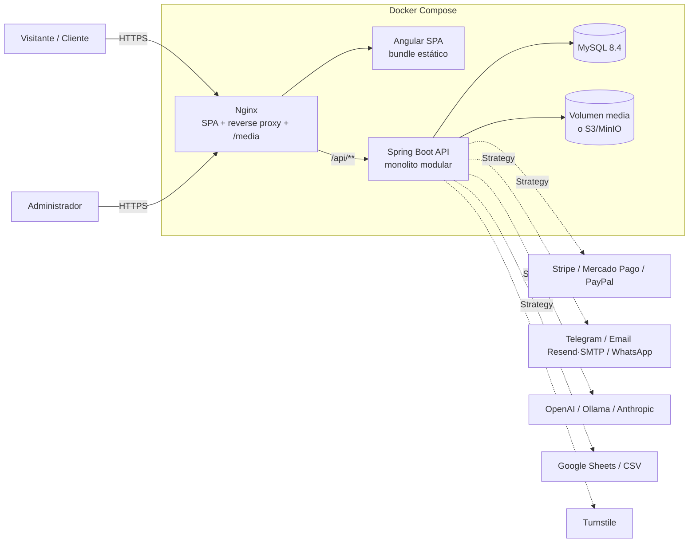
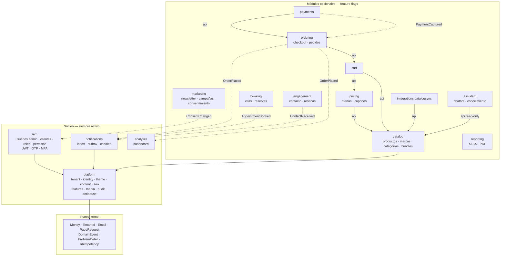
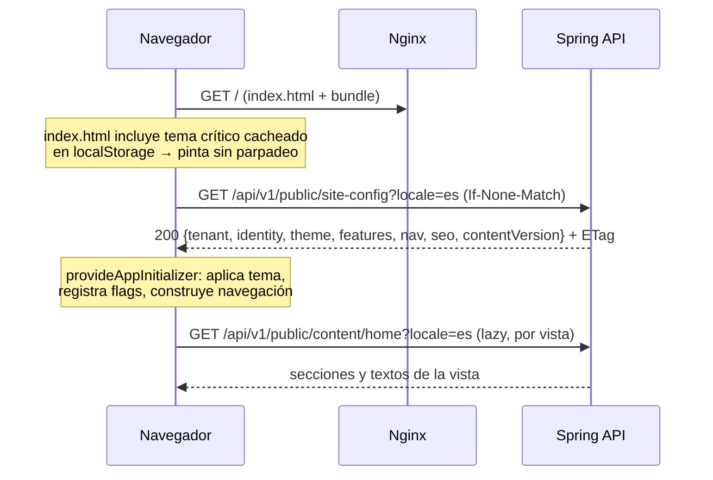
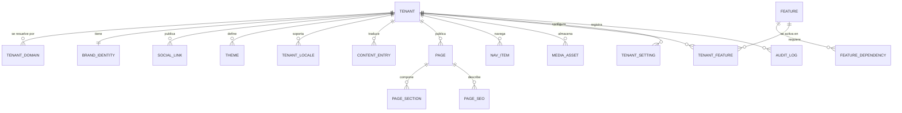
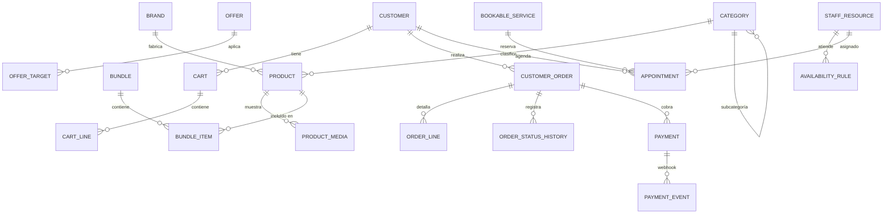
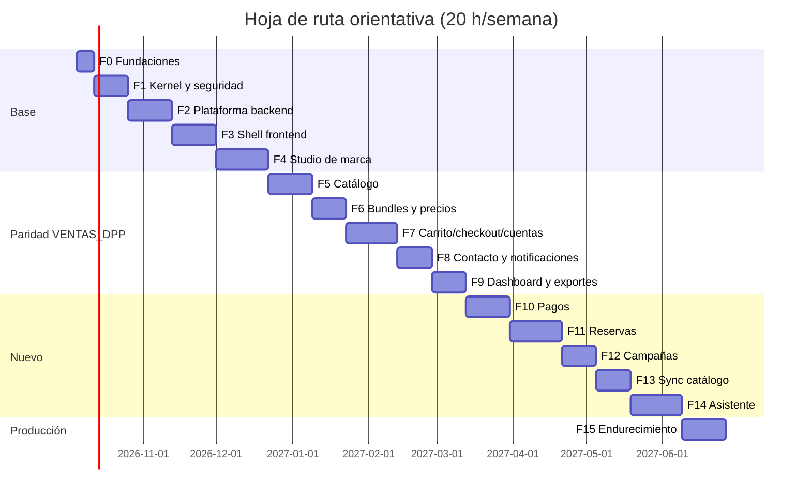

# 02 · Plan técnico de VantageEngine

> **VantageEngine** es un motor de sitios comerciales *white-label*: el mismo código sirve a cualquier negocio cambiando identidad, tema, contenido y módulos activos desde la base de datos, sin redeploy.
>
> Referencia funcional: [`01-INVENTARIO-FUNCIONAL.md`](01-INVENTARIO-FUNCIONAL.md). Brief visual para la fase de diseño: [`03-BRIEF-DISENO-UI.md`](03-BRIEF-DISENO-UI.md).

## Índice

0. [Decisiones de base y stack](#0-decisiones-de-base-y-stack)
1. [Arquitectura del sistema](#1-arquitectura-del-sistema)
2. [Modelo de datos relacional](#2-modelo-de-datos-relacional)
3. [Theming y contenido dinámico en Angular](#3-theming-y-contenido-dinámico-en-angular)
4. [Feature toggling en backend y frontend](#4-feature-toggling-en-backend-y-frontend)
5. [Hoja de ruta de implementación](#5-hoja-de-ruta-de-implementación)
6. [Estructura de carpetas](#6-estructura-de-carpetas)
7. [Calidad, seguridad y convenciones](#7-calidad-seguridad-y-convenciones)
8. [Riesgos y decisiones abiertas](#8-riesgos-y-decisiones-abiertas)

---

## 0. Decisiones de base y stack

| Área | Elección | Motivo |
|---|---|---|
| Lenguaje backend | **Java 21 LTS** (subir a 25 LTS cuando el ecosistema lo permita) | Records, *pattern matching*, *virtual threads* |
| Framework | **Spring Boot 4.x** (o la 3.5.x más reciente si alguna dependencia aún no soporta la 4) | Soporte actual, Spring Security 7, observabilidad nativa |
| Modularidad | **Spring Modulith** | Hace verificables los límites entre módulos (test `ApplicationModules.verify()`), eventos entre módulos, documentación generada |
| Persistencia | **MySQL 8.4 LTS** + Spring Data JPA (Hibernate 6/7) + **Flyway** | Requisito; `CHECK` y JSON nativos; migraciones versionadas |
| Seguridad | Spring Security + **JWT firmado (RS256/EdDSA) en cookie `HttpOnly`** + CSRF + RBAC por permisos + MFA TOTP para admins | Heredado y endurecido: el JWT nunca toca JavaScript |
| API | REST + **OpenAPI 3** (springdoc) + errores **RFC 9457 `ProblemDetail`** | Contrato generado → cliente TypeScript generado |
| Frontend | **Angular 21+** standalone, **zoneless**, **Signals**, `@defer`, control flow `@if/@for`, lazy loading por feature | Estándar actual de Angular |
| Estado frontend | Signals + servicios *store* por feature (`signal`, `computed`, `resource`/`httpResource`); RxJS solo para streams (SSE del asistente, websockets, debounce de búsqueda) | Simple, sin NgRx salvo que crezca |
| Estilos | CSS moderno + **design tokens en CSS custom properties** (`oklch`, `color-mix()`), sin framework de componentes pesado; **Angular CDK** para overlays, a11y y drag&drop | Tematizable al 100 % en tiempo real |
| Tests | Backend: JUnit 5, AssertJ, **Testcontainers (MySQL real)**, ArchUnit/Modulith. Frontend: **Vitest** + Angular Testing Library, **Playwright** E2E | Pirámide de pruebas completa |
| Contenedores | Docker multi-stage + **Docker Compose** (perfiles `dev`, `prod`, `observability`) | Clonar → `docker compose up` |
| CI | GitHub Actions: build, test, lint, cobertura, OWASP dependency-check/Trivy, Gitleaks, build de imágenes | Evidencia automática en cada PR |

**Tenancy:** el esquema es *multi-tenant ready* (todas las tablas de negocio llevan `tenant_id`) y el tenant se resuelve por dominio (`Host`). El despliegue por defecto es **un tenant por instalación**, pero el mismo binario puede servir varios dominios. Esto da el máximo valor de portafolio con el mínimo coste operativo. Ver ADR-001 en §8.

---

## 1. Arquitectura del sistema

### 1.1 Vista de contexto



### 1.2 Monolito modular: núcleo vs. módulos opcionales

La regla de oro: **el núcleo no conoce a los módulos opcionales**; los módulos opcionales dependen del núcleo y se comunican entre sí **solo por eventos de dominio o por interfaces publicadas (`api` package)**.



Líneas continuas = dependencia de compilación (solo hacia paquetes `api` públicos). Líneas punteadas = eventos asíncronos (Spring Modulith `@ApplicationModuleListener`, persistidos en el *event publication registry* → entrega garantizada). Si `notifications` no tuviera un canal activo, el evento simplemente no produce entregas; **el pedido nunca falla por un módulo apagado**.

### 1.3 Arquitectura interna de cada módulo (hexagonal ligera)

```text
catalog/
├── api/              ← ÚNICO paquete visible para otros módulos
│   ├── CatalogQueries.java        (interfaz: findProductSnapshot(id)…)
│   ├── ProductSnapshot.java       (record inmutable)
│   └── events/ProductPublished.java
├── domain/           ← Java puro: entidades, value objects, reglas, puertos
│   ├── model/Product.java, Brand.java, Category.java, Bundle.java
│   ├── model/Slug.java, Sku.java
│   └── port/ProductRepository.java  (interfaz de salida)
├── application/      ← casos de uso (1 clase = 1 intención), transacciones
│   ├── CreateProductUseCase.java
│   ├── PublishProductUseCase.java
│   └── query/SearchProductsQuery.java
├── infrastructure/   ← adaptadores: JPA, storage, clientes HTTP
│   ├── persistence/ProductJpaEntity.java, ProductJpaRepository.java, ProductRepositoryAdapter.java
│   └── mapping/ProductPersistenceMapper.java  (MapStruct)
└── web/              ← adaptadores de entrada: REST
    ├── public_/ProductPublicController.java     (/api/v1/catalog/**)
    ├── admin/ProductAdminController.java        (/api/v1/admin/catalog/**)
    └── dto/ …Request / …Response (records) + mappers
```

Reglas verificadas automáticamente (ArchUnit + `ApplicationModules.verify()`):

- `domain` no importa Spring, JPA ni `web`.
- `web` solo llama a `application`; nunca a repositorios.
- Ningún módulo importa `*.domain`, `*.infrastructure` o `*.web` de **otro** módulo; solo su `api`.
- Entidades JPA nunca salen de `infrastructure` (los controladores devuelven DTOs).

> **Pragmatismo:** en módulos CRUD simples (marcas, categorías) se permite que la entidad JPA sea el modelo de dominio para no duplicar clases sin valor. La separación estricta se reserva para dominios con reglas (pricing, ordering, booking, payments). Se documenta en ADR-003.

### 1.4 Patrones de diseño aplicados (dónde y por qué)

| Patrón | Dónde | Para qué |
|---|---|---|
| **Strategy + Registry** | `PaymentGateway`, `NotificationChannel`, `CheckoutFlow`, `CatalogSource`, `StorageProvider`, `CaptchaVerifier`, `AiChatProvider` | Intercambiar proveedores por configuración del tenant sin `if/else` |
| **Chain of Responsibility** | Motor de precios (`PriceRule`s: lista → oferta automática → cupón → redondeo) | Reglas componibles y testeables por separado |
| **Specification** | Filtros de catálogo, elegibilidad de ofertas, segmentos de audiencia | Combinar criterios (`and/or`) sin SQL disperso |
| **Transactional Outbox** | `notifications`, `marketing.campaigns`, webhooks salientes | Nunca perder un aviso aunque el proveedor falle |
| **Domain Events** | Entre módulos (Modulith) | Desacoplar opcionales del núcleo |
| **Template Method** | Importadores (`AbstractCatalogImporter`: fetch → parse → diff → apply) | Mismo flujo, distintas fuentes |
| **Decorator** | `CachingFeatureFlagService`, `AuditingUseCase` | Añadir caché/auditoría sin tocar la lógica |
| **Factory** | `SectionRendererFactory` (backend valida props de secciones), `ThemePaletteFactory` | Construir objetos válidos desde JSON |
| **Adapter / Ports & Adapters** | Toda integración externa | Tests sin red; cambiar proveedor sin tocar dominio |
| **State** | Ciclo de vida de `Order`, `Appointment`, `Payment` | Transiciones explícitas y validadas |
| **Idempotency Key** | Checkout, contacto, webhooks de pago | Reintentos seguros |

### 1.5 Flujo de arranque de la SPA (config-first)



Un único endpoint agregado (`site-config`) evita 5 peticiones en cascada; los textos de cada vista se cargan *lazy* junto con la ruta. Detalle en §3.

---

## 2. Modelo de datos relacional

### 2.1 Convenciones

- Inglés, `snake_case`, tablas en singular (`product`, `order_line`).
- PK `BIGINT UNSIGNED AUTO_INCREMENT` interna; **nunca se expone**: la API usa `public_id CHAR(26)` (ULID) o `slug`.
- Toda tabla de negocio: `tenant_id` (FK), `created_at`, `updated_at` (`DATETIME(6)` en UTC), `version INT` (bloqueo optimista) y, si aplica, `deleted_at` (baja lógica).
- Índices únicos siempre incluyen `tenant_id` (`uk_product_tenant_slug`).
- Dinero: `DECIMAL(19,4)` + `currency CHAR(3)` (ISO 4217).
- `JSON` solo para configuración extensible **validada contra un JSON Schema** declarado por el propio módulo; nunca para datos que se filtran o se relacionan.
- Nombres de constraints explícitos: `pk_`, `fk_<tabla>_<ref>`, `uk_`, `ix_`, `ck_`.
- Charset `utf8mb4`, collation `utf8mb4_0900_ai_ci`.

### 2.2 Diagrama del núcleo de plataforma



### 2.3 DDL — plataforma (identidad, tema, contenido, módulos)

```sql
-- V1__platform_tenant.sql -------------------------------------------------
CREATE TABLE tenant (
    id              BIGINT UNSIGNED AUTO_INCREMENT,
    public_id       CHAR(26)     NOT NULL,
    code            VARCHAR(50)  NOT NULL,              -- 'diesel-power-pro'
    status          VARCHAR(20)  NOT NULL DEFAULT 'ACTIVE',
    default_locale  VARCHAR(10)  NOT NULL DEFAULT 'es',
    default_currency CHAR(3)     NOT NULL DEFAULT 'USD',
    timezone        VARCHAR(50)  NOT NULL DEFAULT 'UTC',
    created_at      DATETIME(6)  NOT NULL DEFAULT CURRENT_TIMESTAMP(6),
    updated_at      DATETIME(6)  NOT NULL DEFAULT CURRENT_TIMESTAMP(6) ON UPDATE CURRENT_TIMESTAMP(6),
    version         INT          NOT NULL DEFAULT 0,
    CONSTRAINT pk_tenant PRIMARY KEY (id),
    CONSTRAINT uk_tenant_public_id UNIQUE (public_id),
    CONSTRAINT uk_tenant_code UNIQUE (code),
    CONSTRAINT ck_tenant_status CHECK (status IN ('ACTIVE','SUSPENDED','ARCHIVED'))
);

CREATE TABLE tenant_domain (
    id          BIGINT UNSIGNED AUTO_INCREMENT,
    tenant_id   BIGINT UNSIGNED NOT NULL,
    hostname    VARCHAR(253)    NOT NULL,               -- 'shop.midominio.com', 'localhost'
    is_primary  BOOLEAN         NOT NULL DEFAULT FALSE,
    CONSTRAINT pk_tenant_domain PRIMARY KEY (id),
    CONSTRAINT uk_tenant_domain_hostname UNIQUE (hostname),
    CONSTRAINT fk_tenant_domain_tenant FOREIGN KEY (tenant_id) REFERENCES tenant(id)
);

-- Configuración tipada del tenant que no merece columna propia (clave→valor validado)
CREATE TABLE tenant_setting (
    tenant_id   BIGINT UNSIGNED NOT NULL,
    setting_key VARCHAR(100)    NOT NULL,               -- 'checkout.mode', 'contact.channels'
    value_json  JSON            NOT NULL,
    updated_at  DATETIME(6)     NOT NULL DEFAULT CURRENT_TIMESTAMP(6) ON UPDATE CURRENT_TIMESTAMP(6),
    updated_by  BIGINT UNSIGNED NULL,
    CONSTRAINT pk_tenant_setting PRIMARY KEY (tenant_id, setting_key),
    CONSTRAINT fk_tenant_setting_tenant FOREIGN KEY (tenant_id) REFERENCES tenant(id)
);

-- V2__platform_media.sql --------------------------------------------------
CREATE TABLE media_asset (
    id            BIGINT UNSIGNED AUTO_INCREMENT,
    public_id     CHAR(26)     NOT NULL,
    tenant_id     BIGINT UNSIGNED NOT NULL,
    storage_key   VARCHAR(512) NOT NULL,                -- ruta relativa o key S3; nunca ruta de host
    original_name VARCHAR(255) NOT NULL,
    mime_type     VARCHAR(100) NOT NULL,
    size_bytes    BIGINT UNSIGNED NOT NULL,
    width_px      INT UNSIGNED NULL,
    height_px     INT UNSIGNED NULL,
    sha256        CHAR(64)     NOT NULL,
    alt_text      VARCHAR(255) NULL,
    created_at    DATETIME(6)  NOT NULL DEFAULT CURRENT_TIMESTAMP(6),
    deleted_at    DATETIME(6)  NULL,
    CONSTRAINT pk_media_asset PRIMARY KEY (id),
    CONSTRAINT uk_media_asset_public_id UNIQUE (public_id),
    CONSTRAINT uk_media_asset_tenant_hash UNIQUE (tenant_id, sha256),
    CONSTRAINT fk_media_asset_tenant FOREIGN KEY (tenant_id) REFERENCES tenant(id)
);

-- V3__platform_identity.sql ----------------------------------------------
CREATE TABLE brand_identity (
    tenant_id          BIGINT UNSIGNED NOT NULL,
    display_name       VARCHAR(120) NOT NULL,           -- 'Diesel Power Pro'
    legal_name         VARCHAR(200) NULL,
    tagline            VARCHAR(200) NULL,
    logo_asset_id      BIGINT UNSIGNED NULL,
    logo_dark_asset_id BIGINT UNSIGNED NULL,            -- variante para fondos oscuros
    favicon_asset_id   BIGINT UNSIGNED NULL,
    og_image_asset_id  BIGINT UNSIGNED NULL,
    support_email      VARCHAR(254) NULL,
    support_phone      VARCHAR(32)  NULL,
    address_text       VARCHAR(500) NULL,
    updated_at         DATETIME(6)  NOT NULL DEFAULT CURRENT_TIMESTAMP(6) ON UPDATE CURRENT_TIMESTAMP(6),
    version            INT          NOT NULL DEFAULT 0,
    CONSTRAINT pk_brand_identity PRIMARY KEY (tenant_id),
    CONSTRAINT fk_brand_identity_tenant  FOREIGN KEY (tenant_id) REFERENCES tenant(id),
    CONSTRAINT fk_brand_identity_logo    FOREIGN KEY (logo_asset_id) REFERENCES media_asset(id),
    CONSTRAINT fk_brand_identity_logo_dk FOREIGN KEY (logo_dark_asset_id) REFERENCES media_asset(id),
    CONSTRAINT fk_brand_identity_favicon FOREIGN KEY (favicon_asset_id) REFERENCES media_asset(id),
    CONSTRAINT fk_brand_identity_og      FOREIGN KEY (og_image_asset_id) REFERENCES media_asset(id)
);

CREATE TABLE social_link (
    id          BIGINT UNSIGNED AUTO_INCREMENT,
    tenant_id   BIGINT UNSIGNED NOT NULL,
    network     VARCHAR(30)  NOT NULL,                  -- FACEBOOK, INSTAGRAM, TIKTOK, TELEGRAM, WHATSAPP, TEAMS, X, YOUTUBE, LINKEDIN
    url         VARCHAR(500) NOT NULL,
    sort_order  SMALLINT     NOT NULL DEFAULT 0,
    is_visible  BOOLEAN      NOT NULL DEFAULT TRUE,
    CONSTRAINT pk_social_link PRIMARY KEY (id),
    CONSTRAINT uk_social_link_tenant_network UNIQUE (tenant_id, network),
    CONSTRAINT fk_social_link_tenant FOREIGN KEY (tenant_id) REFERENCES tenant(id)
);

-- V4__platform_theme.sql -------------------------------------------------
-- Colores semilla en columnas (validables, consultables); el resto de tokens derivados/avanzados en JSON.
CREATE TABLE theme (
    id               BIGINT UNSIGNED AUTO_INCREMENT,
    tenant_id        BIGINT UNSIGNED NOT NULL,
    name             VARCHAR(80)  NOT NULL,             -- 'Industrial Red', 'Borrador verano'
    status           VARCHAR(20)  NOT NULL DEFAULT 'DRAFT',
    color_scheme     VARCHAR(10)  NOT NULL DEFAULT 'DARK',   -- LIGHT | DARK | AUTO
    primary_color    CHAR(7)      NOT NULL,             -- #C72026
    secondary_color  CHAR(7)      NOT NULL,
    accent_color     CHAR(7)      NOT NULL,
    neutral_color    CHAR(7)      NOT NULL,             -- base para superficies y texto
    success_color    CHAR(7)      NOT NULL DEFAULT '#1F9D55',
    warning_color    CHAR(7)      NOT NULL DEFAULT '#D97706',
    danger_color     CHAR(7)      NOT NULL DEFAULT '#DC2626',
    font_display     VARCHAR(80)  NOT NULL DEFAULT 'Inter',
    font_body        VARCHAR(80)  NOT NULL DEFAULT 'Inter',
    radius_scale     VARCHAR(10)  NOT NULL DEFAULT 'SM', -- NONE | SM | MD | LG | FULL
    density          VARCHAR(10)  NOT NULL DEFAULT 'COMFORTABLE',
    extra_tokens     JSON         NULL,                 -- overrides avanzados validados por schema
    published_at     DATETIME(6)  NULL,
    created_at       DATETIME(6)  NOT NULL DEFAULT CURRENT_TIMESTAMP(6),
    updated_at       DATETIME(6)  NOT NULL DEFAULT CURRENT_TIMESTAMP(6) ON UPDATE CURRENT_TIMESTAMP(6),
    version          INT          NOT NULL DEFAULT 0,
    -- columna generada para garantizar un solo tema publicado por tenant
    published_guard  BIGINT UNSIGNED AS (CASE WHEN status = 'PUBLISHED' THEN tenant_id END) STORED,
    CONSTRAINT pk_theme PRIMARY KEY (id),
    CONSTRAINT uk_theme_one_published UNIQUE (published_guard),
    CONSTRAINT fk_theme_tenant FOREIGN KEY (tenant_id) REFERENCES tenant(id),
    CONSTRAINT ck_theme_status CHECK (status IN ('DRAFT','PUBLISHED','ARCHIVED')),
    CONSTRAINT ck_theme_primary CHECK (primary_color REGEXP '^#[0-9A-Fa-f]{6}$'),
    CONSTRAINT ck_theme_secondary CHECK (secondary_color REGEXP '^#[0-9A-Fa-f]{6}$'),
    CONSTRAINT ck_theme_accent CHECK (accent_color REGEXP '^#[0-9A-Fa-f]{6}$'),
    CONSTRAINT ck_theme_neutral CHECK (neutral_color REGEXP '^#[0-9A-Fa-f]{6}$')
);

-- V5__platform_content.sql -----------------------------------------------
CREATE TABLE tenant_locale (
    tenant_id  BIGINT UNSIGNED NOT NULL,
    locale     VARCHAR(10) NOT NULL,                    -- BCP 47: 'es', 'en', 'es-MX'
    is_enabled BOOLEAN     NOT NULL DEFAULT TRUE,
    CONSTRAINT pk_tenant_locale PRIMARY KEY (tenant_id, locale),
    CONSTRAINT fk_tenant_locale_tenant FOREIGN KEY (tenant_id) REFERENCES tenant(id)
);

-- Textos cortos de UI (microcopy): botones, etiquetas, mensajes, títulos
CREATE TABLE content_entry (
    id          BIGINT UNSIGNED AUTO_INCREMENT,
    tenant_id   BIGINT UNSIGNED NOT NULL,
    locale      VARCHAR(10)  NOT NULL,
    namespace   VARCHAR(50)  NOT NULL,                  -- 'common', 'home', 'checkout', 'admin'
    entry_key   VARCHAR(150) NOT NULL,                  -- 'hero.title', 'cta.addToCart'
    value_text  TEXT         NOT NULL,                  -- admite ICU MessageFormat: {count, plural, …}
    updated_at  DATETIME(6)  NOT NULL DEFAULT CURRENT_TIMESTAMP(6) ON UPDATE CURRENT_TIMESTAMP(6),
    updated_by  BIGINT UNSIGNED NULL,
    CONSTRAINT pk_content_entry PRIMARY KEY (id),
    CONSTRAINT uk_content_entry UNIQUE (tenant_id, locale, namespace, entry_key),
    CONSTRAINT fk_content_entry_locale FOREIGN KEY (tenant_id, locale) REFERENCES tenant_locale(tenant_id, locale)
);

-- Páginas compuestas por secciones (home, about, faqs, landing de campaña, legales)
CREATE TABLE page (
    id           BIGINT UNSIGNED AUTO_INCREMENT,
    tenant_id    BIGINT UNSIGNED NOT NULL,
    page_key     VARCHAR(80)  NOT NULL,                 -- 'home', 'faqs', 'privacy', 'about'
    route_path   VARCHAR(200) NOT NULL,                 -- '/', '/faqs'
    page_type    VARCHAR(20)  NOT NULL,                 -- SYSTEM (ruta de código) | CMS (renderizada por secciones)
    status       VARCHAR(20)  NOT NULL DEFAULT 'DRAFT',
    required_feature VARCHAR(50) NULL,                  -- p.ej. 'booking' → la página se oculta si el módulo está apagado
    published_at DATETIME(6)  NULL,
    updated_at   DATETIME(6)  NOT NULL DEFAULT CURRENT_TIMESTAMP(6) ON UPDATE CURRENT_TIMESTAMP(6),
    version      INT          NOT NULL DEFAULT 0,
    CONSTRAINT pk_page PRIMARY KEY (id),
    CONSTRAINT uk_page_key UNIQUE (tenant_id, page_key),
    CONSTRAINT uk_page_route UNIQUE (tenant_id, route_path),
    CONSTRAINT fk_page_tenant FOREIGN KEY (tenant_id) REFERENCES tenant(id),
    CONSTRAINT ck_page_type CHECK (page_type IN ('SYSTEM','CMS')),
    CONSTRAINT ck_page_status CHECK (status IN ('DRAFT','PUBLISHED','ARCHIVED'))
);

CREATE TABLE page_section (
    id            BIGINT UNSIGNED AUTO_INCREMENT,
    page_id       BIGINT UNSIGNED NOT NULL,
    locale        VARCHAR(10)  NOT NULL,
    section_type  VARCHAR(50)  NOT NULL,                -- HERO, FEATURE_GRID, PRODUCT_CAROUSEL, BRAND_MARQUEE, FAQ_LIST, RICH_TEXT, CTA_BANNER, TESTIMONIALS, NEWSLETTER, CONTACT_CTA
    sort_order    SMALLINT     NOT NULL,
    is_visible    BOOLEAN      NOT NULL DEFAULT TRUE,
    props_json    JSON         NOT NULL,                -- validado contra el JSON Schema del section_type
    required_feature VARCHAR(50) NULL,                  -- PRODUCT_CAROUSEL → 'catalog'
    CONSTRAINT pk_page_section PRIMARY KEY (id),
    CONSTRAINT uk_page_section_order UNIQUE (page_id, locale, sort_order),
    CONSTRAINT fk_page_section_page FOREIGN KEY (page_id) REFERENCES page(id) ON DELETE CASCADE
);

CREATE TABLE page_seo (
    page_id         BIGINT UNSIGNED NOT NULL,
    locale          VARCHAR(10)  NOT NULL,
    title           VARCHAR(70)  NOT NULL,              -- admite {brand}: "Productos | {brand}"
    description     VARCHAR(170) NULL,
    og_image_asset_id BIGINT UNSIGNED NULL,
    robots          VARCHAR(40)  NOT NULL DEFAULT 'index,follow',
    CONSTRAINT pk_page_seo PRIMARY KEY (page_id, locale),
    CONSTRAINT fk_page_seo_page FOREIGN KEY (page_id) REFERENCES page(id) ON DELETE CASCADE,
    CONSTRAINT fk_page_seo_og FOREIGN KEY (og_image_asset_id) REFERENCES media_asset(id)
);

CREATE TABLE nav_item (
    id              BIGINT UNSIGNED AUTO_INCREMENT,
    tenant_id       BIGINT UNSIGNED NOT NULL,
    menu            VARCHAR(20)  NOT NULL,              -- HEADER | FOOTER | ACCOUNT
    parent_id       BIGINT UNSIGNED NULL,
    label_key       VARCHAR(150) NOT NULL,              -- apunta a content_entry (namespace 'nav')
    target_type     VARCHAR(10)  NOT NULL,              -- PAGE | ROUTE | URL
    target_value    VARCHAR(500) NOT NULL,
    required_feature VARCHAR(50) NULL,
    sort_order      SMALLINT     NOT NULL DEFAULT 0,
    CONSTRAINT pk_nav_item PRIMARY KEY (id),
    CONSTRAINT fk_nav_item_tenant FOREIGN KEY (tenant_id) REFERENCES tenant(id),
    CONSTRAINT fk_nav_item_parent FOREIGN KEY (parent_id) REFERENCES nav_item(id)
);

CREATE TABLE url_redirect (
    id          BIGINT UNSIGNED AUTO_INCREMENT,
    tenant_id   BIGINT UNSIGNED NOT NULL,
    from_path   VARCHAR(300) NOT NULL,
    to_path     VARCHAR(300) NOT NULL,
    status_code SMALLINT     NOT NULL DEFAULT 301,
    CONSTRAINT pk_url_redirect PRIMARY KEY (id),
    CONSTRAINT uk_url_redirect UNIQUE (tenant_id, from_path),
    CONSTRAINT fk_url_redirect_tenant FOREIGN KEY (tenant_id) REFERENCES tenant(id)
);

-- V6__platform_features.sql ----------------------------------------------
-- Catálogo global de módulos (lo define el código vía seed; no lo edita el tenant)
CREATE TABLE feature (
    code            VARCHAR(50)  NOT NULL,              -- 'catalog', 'cart', 'checkout', 'payments', 'booking'…
    category        VARCHAR(30)  NOT NULL,              -- COMMERCE | ENGAGEMENT | MARKETING | INTEGRATION | AI
    is_core         BOOLEAN      NOT NULL DEFAULT FALSE,-- core = no desactivable
    default_enabled BOOLEAN      NOT NULL DEFAULT FALSE,
    config_schema   JSON         NULL,                  -- JSON Schema de su configuración
    CONSTRAINT pk_feature PRIMARY KEY (code)
);

CREATE TABLE feature_dependency (
    feature_code  VARCHAR(50) NOT NULL,
    requires_code VARCHAR(50) NOT NULL,
    CONSTRAINT pk_feature_dependency PRIMARY KEY (feature_code, requires_code),
    CONSTRAINT fk_feature_dep_feature  FOREIGN KEY (feature_code)  REFERENCES feature(code),
    CONSTRAINT fk_feature_dep_requires FOREIGN KEY (requires_code) REFERENCES feature(code),
    CONSTRAINT ck_feature_dep_self CHECK (feature_code <> requires_code)
);

CREATE TABLE tenant_feature (
    tenant_id     BIGINT UNSIGNED NOT NULL,
    feature_code  VARCHAR(50)  NOT NULL,
    is_enabled    BOOLEAN      NOT NULL,
    config_json   JSON         NULL,                    -- p.ej. payments: {"providers":["STRIPE"],"mode":"TEST"}
    enabled_from  DATETIME(6)  NULL,                    -- activación programada (opcional)
    enabled_until DATETIME(6)  NULL,
    updated_at    DATETIME(6)  NOT NULL DEFAULT CURRENT_TIMESTAMP(6) ON UPDATE CURRENT_TIMESTAMP(6),
    updated_by    BIGINT UNSIGNED NULL,
    version       INT          NOT NULL DEFAULT 0,
    CONSTRAINT pk_tenant_feature PRIMARY KEY (tenant_id, feature_code),
    CONSTRAINT fk_tenant_feature_tenant  FOREIGN KEY (tenant_id) REFERENCES tenant(id),
    CONSTRAINT fk_tenant_feature_feature FOREIGN KEY (feature_code) REFERENCES feature(code)
);

-- V7__platform_audit.sql -------------------------------------------------
CREATE TABLE audit_log (
    id           BIGINT UNSIGNED AUTO_INCREMENT,
    tenant_id    BIGINT UNSIGNED NOT NULL,
    actor_type   VARCHAR(20)  NOT NULL,                 -- ADMIN_USER | CUSTOMER | SYSTEM
    actor_id     BIGINT UNSIGNED NULL,
    action       VARCHAR(80)  NOT NULL,                 -- 'THEME_PUBLISHED', 'FEATURE_TOGGLED'
    resource     VARCHAR(80)  NOT NULL,
    resource_id  VARCHAR(64)  NULL,
    diff_json    JSON         NULL,                     -- antes/después (sin secretos)
    ip_hash      CHAR(64)     NULL,
    occurred_at  DATETIME(6)  NOT NULL DEFAULT CURRENT_TIMESTAMP(6),
    CONSTRAINT pk_audit_log PRIMARY KEY (id),
    CONSTRAINT fk_audit_log_tenant FOREIGN KEY (tenant_id) REFERENCES tenant(id),
    INDEX ix_audit_log_tenant_time (tenant_id, occurred_at)
);
```

**Por qué este diseño está normalizado y no es un "EAV" genérico:**
identidad y tema son **1:1 / 1:N con columnas tipadas y `CHECK`s** (lo que se consulta y valida); `tenant_setting` y `*_json` solo guardan configuración de módulo cuya forma define el propio módulo y que se valida contra `feature.config_schema` antes de persistir. Los textos (`content_entry`) están en 3FN: clave natural `(tenant, locale, namespace, key)`.

### 2.4 IAM (identidad y acceso)

```sql
CREATE TABLE app_user (             -- administradores / personal
    id BIGINT UNSIGNED AUTO_INCREMENT PRIMARY KEY,
    public_id CHAR(26) NOT NULL UNIQUE,
    tenant_id BIGINT UNSIGNED NOT NULL,
    email VARCHAR(254) NOT NULL,
    password_hash VARCHAR(100) NOT NULL,          -- Argon2id / BCrypt
    full_name VARCHAR(120) NOT NULL,
    status VARCHAR(20) NOT NULL DEFAULT 'ACTIVE',
    mfa_secret_enc VARBINARY(255) NULL,           -- TOTP cifrado (AES-GCM, clave fuera de BD)
    last_login_at DATETIME(6) NULL,
    created_at DATETIME(6) NOT NULL DEFAULT CURRENT_TIMESTAMP(6),
    version INT NOT NULL DEFAULT 0,
    CONSTRAINT uk_app_user_email UNIQUE (tenant_id, email),
    CONSTRAINT fk_app_user_tenant FOREIGN KEY (tenant_id) REFERENCES tenant(id)
);
CREATE TABLE role        (id BIGINT UNSIGNED AUTO_INCREMENT PRIMARY KEY, tenant_id BIGINT UNSIGNED NULL, code VARCHAR(50) NOT NULL, is_system BOOLEAN NOT NULL DEFAULT FALSE,
                          CONSTRAINT uk_role UNIQUE (tenant_id, code));             -- tenant_id NULL = rol de sistema (OWNER, ADMIN, EDITOR, SUPPORT)
CREATE TABLE permission  (code VARCHAR(60) PRIMARY KEY, feature_code VARCHAR(50) NULL, description VARCHAR(200) NOT NULL,
                          CONSTRAINT fk_permission_feature FOREIGN KEY (feature_code) REFERENCES feature(code));
CREATE TABLE role_permission (role_id BIGINT UNSIGNED NOT NULL, permission_code VARCHAR(60) NOT NULL, PRIMARY KEY (role_id, permission_code),
                          FOREIGN KEY (role_id) REFERENCES role(id), FOREIGN KEY (permission_code) REFERENCES permission(code));
CREATE TABLE user_role   (user_id BIGINT UNSIGNED NOT NULL, role_id BIGINT UNSIGNED NOT NULL, PRIMARY KEY (user_id, role_id),
                          FOREIGN KEY (user_id) REFERENCES app_user(id), FOREIGN KEY (role_id) REFERENCES role(id));

CREATE TABLE customer (             -- clientes de la tienda (antes: cliente)
    id BIGINT UNSIGNED AUTO_INCREMENT PRIMARY KEY,
    public_id CHAR(26) NOT NULL UNIQUE,
    tenant_id BIGINT UNSIGNED NOT NULL,
    email VARCHAR(254) NOT NULL,
    email_verified_at DATETIME(6) NULL,
    password_hash VARCHAR(100) NULL,               -- NULL = lead sin cuenta
    full_name VARCHAR(120) NULL,
    phone VARCHAR(32) NULL,
    preferred_channel VARCHAR(20) NULL,            -- EMAIL | WHATSAPP | TELEGRAM | PHONE
    channel_handle VARCHAR(120) NULL,
    country_code CHAR(2) NULL,
    status VARCHAR(20) NOT NULL DEFAULT 'LEAD',    -- LEAD | ACTIVE | INACTIVE
    marketing_consent VARCHAR(20) NOT NULL DEFAULT 'UNKNOWN',
    created_at DATETIME(6) NOT NULL DEFAULT CURRENT_TIMESTAMP(6),
    updated_at DATETIME(6) NOT NULL DEFAULT CURRENT_TIMESTAMP(6) ON UPDATE CURRENT_TIMESTAMP(6),
    deleted_at DATETIME(6) NULL,
    version INT NOT NULL DEFAULT 0,
    CONSTRAINT uk_customer_email UNIQUE (tenant_id, email),
    CONSTRAINT fk_customer_tenant FOREIGN KEY (tenant_id) REFERENCES tenant(id)
);
CREATE TABLE auth_challenge (       -- OTP de login/registro/recuperación (unifica codigo_otp, otp_solicitud, auth_challenge)
    id BIGINT UNSIGNED AUTO_INCREMENT PRIMARY KEY,
    tenant_id BIGINT UNSIGNED NOT NULL,
    subject_email VARCHAR(254) NOT NULL,
    purpose VARCHAR(30) NOT NULL,                  -- LOGIN | REGISTER | PASSWORD_RESET | ADMIN_MFA_RECOVERY
    code_hash CHAR(64) NOT NULL,
    attempts SMALLINT NOT NULL DEFAULT 0,
    expires_at DATETIME(6) NOT NULL,
    consumed_at DATETIME(6) NULL,
    created_at DATETIME(6) NOT NULL DEFAULT CURRENT_TIMESTAMP(6),
    INDEX ix_auth_challenge_lookup (tenant_id, subject_email, purpose, expires_at)
);
CREATE TABLE login_attempt (id BIGINT UNSIGNED AUTO_INCREMENT PRIMARY KEY, tenant_id BIGINT UNSIGNED NOT NULL, principal_hash CHAR(64) NOT NULL,
                            ip_hash CHAR(64) NOT NULL, succeeded BOOLEAN NOT NULL, occurred_at DATETIME(6) NOT NULL,
                            INDEX ix_login_attempt (tenant_id, principal_hash, occurred_at));
```

Permisos: se conservan los del sistema anterior renombrados con el prefijo del módulo (`CATALOG_READ`, `CATALOG_WRITE`, `CATALOG_EXPORT`, `PRICING_WRITE`, `ORDER_READ`, `ORDER_WRITE`, `CUSTOMER_READ`, `CUSTOMER_EXPORT`, `CAMPAIGN_SEND`, `CATALOG_SYNC_CONFIGURE`, `ASSISTANT_PUBLISH`, …) y se añaden los de plataforma: `BRANDING_WRITE`, `THEME_PUBLISH`, `CONTENT_WRITE`, `FEATURE_MANAGE`, `MEDIA_WRITE`, `AUDIT_READ`, `BOOKING_MANAGE`, `PAYMENT_REFUND`. La columna `permission.feature_code` permite **ocultar automáticamente** permisos de módulos apagados en el editor de roles.

### 2.5 Dominio comercial (tablas clave, resumen)



| Módulo | Tablas | Notas de diseño |
|---|---|---|
| `catalog` | `brand`, `category` (árbol con `parent_id`), `product`, `product_media` (slot 1..N → `media_asset`), `product_attribute` (clave/valor para especificaciones), `bundle`, `bundle_item` | `product.slug` único por tenant; `status` DRAFT/PUBLISHED/INACTIVE; `video_url` validado (YouTube/Vimeo); índice FULLTEXT `(name, description)` para búsqueda |
| `pricing` | `offer` (mode AUTOMATIC/CODE, discount_type PERCENT/FIXED, priority, starts_at/ends_at UTC, max_redemptions), `offer_target` (target_type PRODUCT/BUNDLE/CATEGORY/ALL + target_id), `offer_redemption` | Una sola oferta ganadora por línea (prioridad ↓, beneficio ↓, id ↑) como en VENTAS_DPP |
| `cart` | `cart` (customer_id NULL + `anonymous_token_hash` para invitados), `cart_line` (line_type PRODUCT/BUNDLE) | Servidor = fuente de verdad; el navegador guarda solo el token. Fusiona carrito anónimo al iniciar sesión |
| `ordering` | `customer_order` (`order_number` legible, `checkout_mode` QUOTE_REQUEST/ONLINE_PAYMENT, snapshot de contacto), `order_line` (snapshots: list_price, offer_code, discount, final_price, currency), `order_status_history`, `idempotency_key` | `order` es palabra reservada → `customer_order`. Estados vía patrón State |
| `payments` | `payment` (provider, provider_ref, amount, status), `payment_event` (payload firmado, `provider_event_id` único para idempotencia), `payment_provider_config` (credenciales **cifradas** por tenant) | Nunca se guardan datos de tarjeta (PCI: el proveedor aloja el formulario) |
| `booking` | `bookable_service` (duración, buffer, precio opcional, capacidad), `staff_resource`, `service_resource`, `availability_rule` (día semana + rango horario + tz), `availability_exception` (vacaciones/bloqueos), `appointment` (starts_at/ends_at UTC, status PENDING/CONFIRMED/CANCELLED/NO_SHOW/COMPLETED) | Anti-doble-reserva: índice + `SELECT … FOR UPDATE` sobre el recurso en la transacción; opcionalmente cobro vía `payments` |
| `engagement` | `contact_message` (canal, destino, fingerprint, idempotency), `review` (backlog) | |
| `marketing` | `consent_event`, `email_suppression`, `unsubscribe_token`, `email_campaign`, `email_campaign_asset`, `email_campaign_recipient` | Heredado casi 1:1, renombrado |
| `notifications` | `notification_event`, `user_notification` (inbox), `outbox_message` (channel, payload, attempts, next_attempt_at, claimed_until, status), `notification_channel_config` | Outbox genérico para todos los canales |
| `assistant` | `chat_session`, `chat_message`, `chat_handoff`, `knowledge_document`, `knowledge_revision`, `assistant_config`, `ai_model` | Heredado; conocimiento versionado con rollback |
| `integrations.catalogsync` | `sync_source`, `sync_preview`, `sync_preview_row`, `sync_mapping`, `sync_binding`, `sync_run` | Heredado y generalizado a N fuentes |

Las migraciones de cada módulo viven en su propia carpeta (`db/migration/<modulo>/`) con prefijos de versión reservados por módulo (plataforma `V1xx`, iam `V2xx`, catalog `V3xx`…), para que añadir un módulo nunca obligue a renumerar.

---

## 3. Theming y contenido dinámico en Angular

### 3.1 Principios

1. **Cero recargas**: el tema y los textos son *signals*; cambiarlos re-renderiza solo lo que los lee.
2. **CSS hace el trabajo pesado**: Angular solo escribe ~10 variables semilla en `:root`; las escalas (hover, bordes, superficies, texto atenuado) se derivan en CSS con `color-mix()` y `oklch`. Así el cambio de tema es **una sola escritura de estilo** → un solo *style recalc* del navegador, sin JavaScript por componente.
3. **Sin parpadeo (FOUC)**: el último tema publicado se guarda en `localStorage` y un script *inline* mínimo en `index.html` lo aplica antes de que arranque Angular; luego se revalida con el servidor (*stale-while-revalidate*).
4. **Tokens por rol, no por color**: los componentes usan `--ve-color-primary`, `--ve-surface-1`, `--ve-text-muted`, nunca `--red`.
5. **Accesibilidad garantizada en el servidor**: al guardar un tema, el backend calcula el contraste WCAG de texto/fondo y rechaza (o avisa) combinaciones por debajo de AA.

### 3.2 Tokens (capa CSS)

```css
/* styles/tokens.css — valores por defecto; ThemeService los sobreescribe en :root */
:root {
  /* semillas (las únicas que escribe JS) */
  --ve-seed-primary:   #c72026;
  --ve-seed-secondary: #1f2937;
  --ve-seed-accent:    #f0444a;
  --ve-seed-neutral:   #111111;
  --ve-font-display:   'Inter', system-ui, sans-serif;
  --ve-font-body:      'Inter', system-ui, sans-serif;
  --ve-radius-base:    4px;
  --ve-space-unit:     4px;

  /* derivados — nunca se escriben desde JS */
  --ve-color-primary:        var(--ve-seed-primary);
  --ve-color-primary-hover:  color-mix(in oklch, var(--ve-seed-primary) 85%, white);
  --ve-color-primary-subtle: color-mix(in oklch, var(--ve-seed-primary) 15%, var(--ve-surface-0));
  --ve-color-on-primary:     var(--ve-on-primary, white);         /* calculado por contraste en backend */
  --ve-surface-0: color-mix(in oklch, var(--ve-seed-neutral) 100%, black);
  --ve-surface-1: color-mix(in oklch, var(--ve-seed-neutral) 92%, white);
  --ve-surface-2: color-mix(in oklch, var(--ve-seed-neutral) 84%, white);
  --ve-border:    color-mix(in oklch, var(--ve-seed-neutral) 70%, white);
  --ve-text:       color-mix(in oklch, var(--ve-seed-neutral) 5%, white);
  --ve-text-muted: color-mix(in oklch, var(--ve-seed-neutral) 40%, white);
  --ve-radius-sm: calc(var(--ve-radius-base) * .5);
  --ve-radius-md: var(--ve-radius-base);
  --ve-radius-lg: calc(var(--ve-radius-base) * 2);
}
:root[data-scheme='light'] { /* inversión de superficies/texto para tema claro */ }
```

### 3.3 `ThemeService` (Signals)

```ts
// platform/theme/theme.service.ts
@Injectable({ providedIn: 'root' })
export class ThemeService {
  private readonly document = inject(DOCUMENT);
  private readonly storage = inject(ThemeCache);          // envoltorio seguro de localStorage

  private readonly published = signal<ThemeTokens>(this.storage.read() ?? DEFAULT_THEME);
  private readonly preview = signal<ThemeTokens | null>(null);  // Studio: vista previa sin guardar

  readonly active = computed(() => this.preview() ?? this.published());

  constructor() {
    // Un único effect escribe las variables: Angular agrupa cambios → una escritura por frame
    effect(() => applyThemeToRoot(this.document.documentElement, this.active()));
  }

  load(theme: ThemeTokens): void { this.published.set(theme); this.storage.write(theme); }
  startPreview(draft: ThemeTokens): void { this.preview.set(draft); }
  endPreview(): void { this.preview.set(null); }
}

function applyThemeToRoot(root: HTMLElement, t: ThemeTokens): void {
  const s = root.style;
  s.setProperty('--ve-seed-primary', t.primary);
  s.setProperty('--ve-seed-secondary', t.secondary);
  s.setProperty('--ve-seed-accent', t.accent);
  s.setProperty('--ve-seed-neutral', t.neutral);
  s.setProperty('--ve-on-primary', t.onPrimary);
  s.setProperty('--ve-font-display', t.fontDisplay);
  s.setProperty('--ve-font-body', t.fontBody);
  s.setProperty('--ve-radius-base', RADIUS[t.radiusScale]);
  root.dataset['scheme'] = t.colorScheme.toLowerCase();
}
```

- **Fuentes**: `FontLoader` inyecta el `<link>` de Google Fonts (o `@font-face` de un asset propio) solo si cambia la familia, con `font-display: swap`.
- **Favicon, título y metadatos**: `BrandingService` actualiza `<link rel=icon>`, `theme-color`, `Title` y `Meta` desde `identity`.
- **Studio (admin)**: el editor de tema llama a `startPreview()` en cada cambio del formulario (con `debounce` de 50 ms). La vista previa se muestra en un `<iframe>` del storefront que recibe el borrador por `postMessage` (aislado del CSS del admin); al publicar, el servidor versiona y emite `ThemePublished`, y todos los clientes lo recogen en su siguiente revalidación del `site-config` (o al instante vía SSE opcional).

### 3.4 Contenido dinámico (textos, páginas, SEO)

**a) Microcopy (`content_entry`)** — cargado por *namespace* junto a la ruta:

```ts
// platform/content/content.store.ts
@Injectable({ providedIn: 'root' })
export class ContentStore {
  private readonly entries = signal<Record<string, string>>({});
  private readonly loaded = new Set<string>();
  readonly locale = signal<string>('es');

  /** Devuelve un signal: la plantilla se actualiza sola si cambia el texto o el idioma. */
  text(key: string, params?: Record<string, unknown>): Signal<string> {
    return computed(() => format(this.entries()[key] ?? key, params, this.locale()));
  }
  async ensureNamespace(ns: string): Promise<void> { /* GET /content/{ns}?locale=… si no está en caché */ }
}

// Pipe para plantillas: {{ 'home.hero.title' | t }}
@Pipe({ name: 't', pure: false })
export class TranslatePipe implements PipeTransform {
  private readonly store = inject(ContentStore);
  transform(key: string, params?: Record<string, unknown>): string { return this.store.text(key, params)(); }
}
```

- `pure: false` es barato aquí porque solo lee un signal memoizado; en componentes críticos se usa `text()` directamente como signal.
- Cada ruta declara sus namespaces con un `ResolveFn` (`contentResolver('checkout')`) → los textos llegan antes de pintar la vista, sin saltos de layout.
- Los textos del bundle de código son solo **claves**; si falta un valor en BD se muestra el valor por defecto del *seed* (nunca la clave cruda en producción: test que lo verifica).

**b) Páginas por secciones (`page` + `page_section`)** — *page builder* ligero:

```ts
// content/sections/section.registry.ts
export const SECTION_REGISTRY: Record<SectionType, () => Promise<Type<SectionComponent>>> = {
  HERO:             () => import('./hero/hero.section').then(m => m.HeroSection),
  PRODUCT_CAROUSEL: () => import('./product-carousel/product-carousel.section').then(m => m.ProductCarouselSection),
  BRAND_MARQUEE:    () => import('./brand-marquee/brand-marquee.section').then(m => m.BrandMarqueeSection),
  FAQ_LIST:         () => import('./faq-list/faq-list.section').then(m => m.FaqListSection),
  RICH_TEXT:        () => import('./rich-text/rich-text.section').then(m => m.RichTextSection),
  CTA_BANNER:       () => import('./cta-banner/cta-banner.section').then(m => m.CtaBannerSection),
  NEWSLETTER:       () => import('./newsletter/newsletter.section').then(m => m.NewsletterSection),
  // …
};
```

```html
<!-- content/page-renderer.component.html -->
@for (section of visibleSections(); track section.id) {
  @defer (on viewport) {
    <ng-container *ngComponentOutlet="resolve(section.type) | async; inputs: section.props" />
  } @placeholder { <ve-section-skeleton [type]="section.type" /> }
}
```

- `visibleSections` = `computed` que filtra por `is_visible` **y** por `required_feature` (si `catalog` se apaga, desaparece el carrusel de productos).
- `@defer (on viewport)` → cada sección y su JS se cargan solo al acercarse al viewport: la home no crece aunque existan 20 tipos de sección.
- Texto enriquecido: el backend guarda un subconjunto seguro (Markdown → HTML sanitizado en servidor); el frontend no usa `bypassSecurityTrust*`.

**c) SEO**: `TitleStrategy` personalizado lee `page_seo` (con `{brand}` interpolado) y `Meta` actualiza `description`/`og:*`. El backend genera `sitemap.xml` y `robots.txt` por tenant. Si se requiere SEO fuerte para catálogo, la fase F15 evalúa **Angular SSR con hidratación incremental** (el diseño con `site-config` es compatible: se resuelve en servidor y se transfiere con `TransferState`).

### 3.5 Rendimiento: garantías medibles

| Riesgo | Mitigación | Métrica en CI (Lighthouse CI / Playwright) |
|---|---|---|
| Parpadeo de tema al cargar | Tema cacheado aplicado por script inline + `site-config` con ETag (304) | CLS < 0.05 |
| Petición bloqueante al inicio | Un solo endpoint agregado, cacheable, < 5 KB gzip; `Cache-Control: max-age=60, stale-while-revalidate=600` | LCP < 2.5 s en 4G simulado |
| Re-render masivo al cambiar tema | Solo cambian variables CSS; los componentes no leen el tema | 0 detecciones de cambio extra (zoneless + OnPush) |
| Bundle grande por muchos módulos | Cada feature es un chunk lazy + `canMatch` evita descargar módulos apagados | Presupuesto inicial < 250 KB gzip |
| Textos que llegan tarde | Resolver por namespace + caché en memoria y `sessionStorage` | Sin *layout shift* por texto |

---

## 4. Feature toggling en backend y frontend

### 4.1 Modelo conceptual

Tres niveles, cada uno con su herramienta (no mezclar):

| Nivel | Qué controla | Mecanismo | Cambia en |
|---|---|---|---|
| **Instalación** (build/boot) | Si el código de una integración pesada se carga (p. ej. SDK de Stripe) | `@ConditionalOnProperty("vantage.modules.payments.enabled")` | Reinicio |
| **Tenant** (runtime) | Si un módulo está disponible para ese negocio | `tenant_feature` + `FeatureFlagService` | Al instante, desde el Studio |
| **Permiso** (runtime) | Si *este usuario* puede usarlo | RBAC (`permission.feature_code`) | Al instante |

Un módulo es utilizable si: `instalado ∧ activo para el tenant ∧ dependencias activas ∧ (ventana enabled_from/until vigente)`.

### 4.2 Backend — núcleo del sistema de flags

```java
// platform/features/api/FeatureKey.java — catálogo tipado (evita strings mágicos)
public enum FeatureKey {
    CATALOG("catalog"), BUNDLES("bundles"), OFFERS("offers"), CART("cart"), CHECKOUT("checkout"),
    PAYMENTS("payments"), BOOKING("booking"), CONTACT_FORM("contact-form"), NEWSLETTER("newsletter"),
    CAMPAIGNS("campaigns"), CUSTOMER_ACCOUNTS("customer-accounts"), ASSISTANT("assistant"),
    ASSISTANT_AI("assistant-ai"), CATALOG_SYNC("catalog-sync"), EXPORTS("exports"), I18N("i18n");
    // code getter, fromCode()…
}

// platform/features/api/FeatureFlags.java — puerto público para todos los módulos
public interface FeatureFlags {
    boolean isEnabled(FeatureKey key);                       // tenant actual (TenantContext)
    <T> T config(FeatureKey key, Class<T> type);             // config_json tipada y validada
    void requireEnabled(FeatureKey key);                     // lanza FeatureDisabledException
}
```

```java
// Implementación: Decorator de caché sobre el repositorio
@Service
class CachingFeatureFlags implements FeatureFlags {
    private final TenantFeatureRepository repository;
    private final FeatureGraph graph;                         // dependencias en memoria (DAG)
    private final Cache<TenantId, EnabledFeatures> cache;     // Caffeine, TTL 60 s + invalidación por evento

    @Override public boolean isEnabled(FeatureKey key) {
        EnabledFeatures enabled = cache.get(TenantContext.current(), this::loadAndResolve);
        return enabled.contains(key);                         // ya incluye resolución de dependencias
    }

    @ApplicationModuleListener
    void on(FeatureToggled event) { cache.invalidate(event.tenantId()); }
}
```

**a) Protección declarativa de APIs — anotación + interceptor**

```java
@Target({TYPE, METHOD}) @Retention(RUNTIME)
public @interface RequiresFeature { FeatureKey value(); }

@RestController
@RequestMapping("/api/v1/booking")
@RequiresFeature(FeatureKey.BOOKING)                         // todo el controlador
class AppointmentPublicController { … }

// HandlerInterceptor registrado en WebMvcConfigurer
final class FeatureGateInterceptor implements HandlerInterceptor {
    @Override public boolean preHandle(HttpServletRequest req, HttpServletResponse res, Object handler) {
        if (handler instanceof HandlerMethod hm) {
            RequiresFeature rf = findOnMethodOrClass(hm);
            if (rf != null && !flags.isEnabled(rf.value())) throw new FeatureDisabledException(rf.value());
        }
        return true;
    }
}
```

`FeatureDisabledException` → `ProblemDetail` **404** con `type: /problems/feature-disabled` (404 y no 403: no revela qué módulos existen a un visitante; el frontend reconoce el `type` y refresca su config). El orden es: filtro de tenant → Spring Security (autenticación) → **FeatureGate** → `@PreAuthorize` (permiso).

**b) Strategy Pattern para variantes de un módulo**

```java
// payments/domain/port/PaymentGateway.java
public interface PaymentGateway {
    PaymentProvider provider();                                     // STRIPE, MERCADO_PAGO, PAYPAL, MANUAL
    CheckoutSession createCheckout(PaymentIntentCommand command);
    WebhookResult handleWebhook(RawWebhook webhook);                // verifica firma + idempotencia
    RefundResult refund(RefundCommand command);
}

@Component @ConditionalOnProperty(prefix = "vantage.payments.stripe", name = "enabled", havingValue = "true")
class StripePaymentGateway implements PaymentGateway { … }

@Component
class MercadoPagoPaymentGateway implements PaymentGateway { … }

// Registry: elige la estrategia según la configuración del tenant
@Component
class PaymentGatewayRegistry {
    private final Map<PaymentProvider, PaymentGateway> gateways;
    PaymentGatewayRegistry(List<PaymentGateway> all) {
        this.gateways = all.stream().collect(toUnmodifiableMap(PaymentGateway::provider, identity()));
    }
    PaymentGateway forTenant(PaymentsConfig cfg) {
        return Optional.ofNullable(gateways.get(cfg.provider()))
                .orElseThrow(() -> new ProviderNotInstalledException(cfg.provider()));
    }
}
```

El mismo patrón se usa para el modo de checkout (el core de `ordering` no sabe de pagos):

```java
public interface CheckoutFlow {                         // ordering/domain/port
    CheckoutMode mode();                                // QUOTE_REQUEST | ONLINE_PAYMENT
    CheckoutResult complete(PlaceOrderCommand cmd);
}
// QuoteRequestCheckoutFlow vive en ordering (siempre disponible si checkout está activo).
// OnlinePaymentCheckoutFlow vive en payments y se registra solo si 'payments' está instalado;
// CheckoutFlowResolver consulta FeatureFlags + tenant_setting 'checkout.modes' para elegir.
```

**c) Otros puntos de enganche**

- **Jobs programados** (`@Scheduled`): envoltorio `TenantAwareJob` que itera tenants con el flag activo (el scheduler de sincronización no corre para quien no tiene `catalog-sync`).
- **Listeners de eventos**: `@ApplicationModuleListener` comprueba `flags.isEnabled()` al inicio → un módulo apagado ignora eventos.
- **Contenido**: `page_section.required_feature`, `nav_item.required_feature` y `page.required_feature` se filtran en el servidor antes de enviar `site-config` (el cliente nunca ve enlaces a módulos apagados).
- **Validación al activar/desactivar** (`ToggleFeatureUseCase`): activar `payments` exige `checkout` activo; desactivar `cart` con `checkout` activo devuelve 409 con la lista de dependientes (o desactiva en cascada si el admin lo confirma). Todo queda en `audit_log`.
- **Datos**: apagar un módulo **nunca borra datos**; solo oculta UI y cierra APIs. Reactivarlo recupera el estado.

### 4.3 Frontend — flags como signals

```ts
// platform/features/feature-flags.service.ts
@Injectable({ providedIn: 'root' })
export class FeatureFlags {
  private readonly enabled = signal<ReadonlySet<FeatureKey>>(new Set());
  readonly all = this.enabled.asReadonly();

  isEnabled(key: FeatureKey): Signal<boolean> { return computed(() => this.enabled().has(key)); }
  snapshot(key: FeatureKey): boolean { return this.enabled().has(key); }
  hydrate(keys: FeatureKey[]): void { this.enabled.set(new Set(keys)); }   // desde site-config
}
```

**a) Guard de rutas con `canMatch`** (mejor que `canActivate`: si no hace *match*, el chunk lazy **ni se descarga** y el router cae al `**` → 404):

```ts
export const featureEnabled = (key: FeatureKey): CanMatchFn =>
  () => inject(FeatureFlags).snapshot(key);

// app.routes.ts — cada feature expone sus rutas; el shell solo las compone
export const routes: Routes = [
  { path: '', component: StorefrontLayout, children: [
      { path: '', loadComponent: () => import('./features/content/pages/page-renderer.page') },
      { path: 'products', canMatch: [featureEnabled('catalog')],  loadChildren: () => import('./features/catalog/catalog.routes') },
      { path: 'cart',     canMatch: [featureEnabled('cart')],     loadChildren: () => import('./features/cart/cart.routes') },
      { path: 'checkout', canMatch: [featureEnabled('checkout')], loadChildren: () => import('./features/checkout/checkout.routes') },
      { path: 'booking',  canMatch: [featureEnabled('booking')],  loadChildren: () => import('./features/booking/booking.routes') },
      { path: 'contact',  canMatch: [featureEnabled('contact-form')], loadChildren: () => import('./features/contact/contact.routes') },
      { path: 'account',  canMatch: [featureEnabled('customer-accounts')], canActivate: [customerAuth], loadChildren: () => import('./features/account/account.routes') },
      { path: ':slug',    loadComponent: () => import('./features/content/pages/page-renderer.page') }, // páginas CMS
  ]},
  { path: 'admin', canMatch: [adminSession], loadChildren: () => import('./admin/admin.routes') },
  { path: '**', loadComponent: () => import('./shared/pages/not-found.page') },
];
```

**b) Directiva estructural para UI**:

```ts
@Directive({ selector: '[veFeature]' })
export class FeatureDirective {
  private readonly flags = inject(FeatureFlags);
  private readonly vcr = inject(ViewContainerRef);
  private readonly tpl = inject(TemplateRef<unknown>);
  readonly veFeature = input.required<FeatureKey>();
  readonly veFeatureElse = input<TemplateRef<unknown> | null>(null);

  constructor() {
    effect(() => {                               // reactivo: si el admin apaga el módulo, la UI reacciona
      this.vcr.clear();
      const tpl = this.flags.isEnabled(this.veFeature())() ? this.tpl : this.veFeatureElse();
      if (tpl) this.vcr.createEmbeddedView(tpl);
    });
  }
}
```

```html
<button *veFeature="'cart'; else quoteOnly" (click)="addToCart(product)">{{ 'cta.addToCart' | t }}</button>
<ng-template #quoteOnly><a routerLink="/contact">{{ 'cta.requestQuote' | t }}</a></ng-template>
```

En código moderno también vale `@if (flags.isEnabled('cart')()) { … }`; la directiva queda para reutilizar el patrón *else* y para legibilidad.

**c) Navegación y admin**: el menú se construye desde `site-config.nav` (ya filtrado por el servidor); el menú del admin se construye desde un **manifiesto de features** (`FEATURE_MANIFEST`: icono, ruta admin, permiso requerido, flag) → cada feature se "registra" y el shell no conoce los módulos concretos.

**d) Resiliencia**: un `HttpInterceptor` detecta `problem.type === 'feature-disabled'`, refresca `site-config` y redirige a una página amable; así un flag apagado mientras el usuario navegaba no rompe la app.

### 4.4 Matriz de módulos iniciales

| Flag | Depende de | Backend | Frontend público | Admin |
|---|---|---|---|---|
| `catalog` | — | `/api/v1/catalog/**` | `/products`, secciones de productos, búsqueda | Productos, marcas, categorías, medios |
| `bundles` | `catalog` | `/api/v1/catalog/bundles/**` | `/bundles` | Paquetes |
| `offers` | `catalog` | pricing + preview de código | badges de oferta, campo cupón | Ofertas |
| `cart` | `catalog` | `/api/v1/cart/**` | icono carrito, `/cart` | — |
| `checkout` | `cart` | `/api/v1/checkout/**`, pedidos | `/checkout` | Pedidos |
| `payments` | `checkout` | `/api/v1/payments/**`, webhooks | paso de pago | Pagos, reembolsos, credenciales |
| `customer-accounts` | — | auth cliente + perfil | login/registro/cuenta | Clientes (el listado de leads existe siempre) |
| `booking` | — (opcional `payments`) | `/api/v1/booking/**` | `/booking`, sección de reserva | Servicios, agenda, disponibilidad |
| `contact-form` | — | `/api/v1/contact` | `/contact` | Mensajes |
| `newsletter` | — | suscripción/baja | sección newsletter | Suscriptores |
| `campaigns` | `newsletter` | campañas | — | Campañas |
| `assistant` / `assistant-ai` | — / `assistant` | chat | widget flotante | Conocimiento, analítica |
| `catalog-sync` | `catalog` | sync | — | Integraciones |
| `exports` | — | XLSX/PDF | — | botones "Exportar" |

---

## 5. Hoja de ruta de implementación

Cada fase termina con un **Definition of Done común**: CI verde (build + tests + lint + escaneo de seguridad), cobertura ≥ 80 % en `domain`/`application` del módulo, OpenAPI actualizado, migraciones Flyway reversibles *forward-only* revisadas, ADR si hubo decisión, demo en `docker compose up` y *changelog*.

Estimaciones orientativas para una persona a tiempo parcial (~20 h/semana).

### Bloque A — Base limpia (sin funcionalidad de negocio)

| Fase | Objetivo | Tareas clave | Entregable verificable | Est. |
|---|---|---|---|---|
| **F0 · Fundaciones** | Repositorio impecable desde el commit 1 | Monorepo `backend/ frontend/ infra/ docs/`; Maven wrapper; Angular CLI zoneless; EditorConfig, Spotless (Java) + ESLint/Prettier (TS); Conventional Commits + commitlint; GitHub Actions (build/test/lint/Gitleaks/Trivy); Dependabot; plantilla de PR; ADR-000 (registro de decisiones); `docker-compose.yml` con MySQL + API + Nginx "hello world"; Testcontainers configurado | `docker compose up` sirve una página y `/actuator/health` = UP; CI verde | 1 sem |
| **F1 · Kernel y seguridad** | Esqueleto de monolito modular seguro | Spring Modulith + test `verify()`; ArchUnit; `TenantResolverFilter` (Host → tenant) + `TenantContext`; `ProblemDetail` global; auditoría; Flyway V1xx plataforma; módulo `iam`: login admin, JWT en cookie HttpOnly, CSRF, refresh, RBAC con permisos, rate-limit de login, seed de OWNER; springdoc OpenAPI | Test de integración: login → cookie → endpoint protegido; test de aislamiento entre tenants | 2 sem |
| **F2 · Plataforma: identidad, tema, contenido, flags (backend)** | El "motor" de personalización | Casos de uso y APIs de `brand_identity`, `social_link`, `theme` (draft/publish + validación de contraste), `content_entry`, `page`/`page_section` (validación de props por JSON Schema), `page_seo`, `nav_item`, `media_asset` (StorageProvider local), `feature`/`tenant_feature` (grafo, caché, eventos, `@RequiresFeature`, interceptor); endpoint agregado `GET /public/site-config` con ETag; seed del tenant demo | Colección de peticiones (`.http`) + tests: apagar `catalog` → 404 en API y desaparece del `site-config` | 2–3 sem |
| **F3 · Shell frontend dinámico** | La SPA se "viste" sola | `provideAppInitializer` con `site-config`; `ThemeService`, `BrandingService`, `ContentStore` + pipe `t`, `FeatureFlags` + `canMatch` + `*veFeature`; script anti-FOUC; tokens CSS; layouts storefront/admin; `PageRendererComponent` + registro de secciones (HERO, RICH_TEXT, CTA_BANNER, FAQ_LIST); componentes base de UI (`button`, `input`, `card`, `dialog`, `toast`, `skeleton`) accesibles; interceptores (credenciales, CSRF, errores, feature-disabled); i18n por namespace | Cambiar un color o un texto en BD → se refleja al recargar config sin recompilar; Lighthouse ≥ 90 | 2–3 sem |
| **F4 · Studio de administración de marca** | El dueño personaliza sin tocar código | Login admin + MFA TOTP; shell admin con menú por manifiesto; editor de identidad (logo, favicon, redes); **editor de tema con preview en vivo** (iframe + postMessage), verificación de contraste; editor de textos por vista/namespace con búsqueda; editor de páginas por secciones (ordenar con CDK drag&drop, visibilidad); SEO por página; toggles de módulos con dependencias; biblioteca de medios; usuarios y roles; visor de auditoría; FAQs y páginas legales como páginas CMS; redirecciones | **Demo clave de portafolio**: re-marcar el sitio completo en 2 minutos en vivo | 3 sem |

### Bloque B — Paridad con VENTAS_DPP (integrar las funciones de tu web anterior)

| Fase | Objetivo | Tareas clave | Entregable | Est. |
|---|---|---|---|---|
| **F5 · Catálogo** | P1–P4, A5–A7 | Marcas (imagen), categorías (árbol), productos (slug, estado, atributos, galería N slots con hover-rotate, video YouTube validado), búsqueda FULLTEXT + filtros (categoría, marca, disponibilidad, precio) + orden con Specification; secciones PRODUCT_CAROUSEL, BRAND_MARQUEE, FEATURED; admin con tablas paginadas y filtros | Catálogo navegable completo; seed con los productos demo | 2–3 sem |
| **F6 · Bundles y precios** | P5, P8, A8–A9 | Paquetes con ítems e imagen de cabecera; motor de precios (Chain of Responsibility) con ofertas automáticas/código, %/fijo, prioridad, vigencia UTC, destinos; `PriceQuote` único consumido por catálogo, carrito y pedidos; preview de cupón | Tests de propiedades del motor (nunca precio negativo, una oferta ganadora) | 2 sem |
| **F7 · Carrito, checkout y cuentas** | P6–P7, P9–P12, A4, A10 | Carrito servidor + token invitado + fusión al login; checkout `QUOTE_REQUEST` (anónimo / autenticado con campos faltantes); pedidos con snapshots, número legible, estados (State), historial; idempotencia; clientes: registro con OTP, login contraseña + OTP, recuperación, perfil, historial, consentimiento; Turnstile como `CaptchaVerifier`; admin de pedidos y clientes | Flujo E2E Playwright: invitado → carrito → solicitud → aparece en admin | 3 sem |
| **F8 · Contacto, newsletter y notificaciones** | P13–P14, P16, A11–A12 | Formulario de contacto (canal preferido + destino normalizado, rate-limit, idempotencia); newsletter con consentimiento y lead; inbox admin; outbox genérico con backoff/jitter/claim; canales `EmailChannel` (SMTP/Resend) y `TelegramChannel` (incl. comandos para cambiar estado de pedidos); botón WhatsApp | Pedido nuevo → aviso Telegram/email con reintentos visibles | 2 sem |
| **F9 · Dashboard y exportaciones** | A2–A4 | KPIs por periodo (pipeline vs. cobrado si hay pagos), rankings, impacto de ofertas, gráfico + tabla accesible; exportación XLSX (clientes, productos, marcas, categorías) con neutralización de fórmulas; PDF del dashboard | Exportes con límites y permisos `*_EXPORT` | 2 sem |

### Bloque C — Funciones nuevas

| Fase | Objetivo | Tareas clave | Entregable | Est. |
|---|---|---|---|---|
| **F10 · Pagos online** | Nuevo | `PaymentGateway` Strategy (Stripe Checkout primero; Mercado Pago segundo), credenciales cifradas por tenant, webhooks firmados e idempotentes, `OnlinePaymentCheckoutFlow`, estados de pago, reembolsos con permiso, modo TEST; página de éxito/cancelación | Pago de prueba end-to-end con Stripe CLI en local | 2–3 sem |
| **F11 · Citas y reservas** | Nuevo | Servicios, recursos/personal, reglas de disponibilidad + excepciones, cálculo de slots en la zona horaria del tenant, reserva con bloqueo anti-doble-reserva, cancelación/reprogramación por token, recordatorios por outbox, pago/depósito opcional vía `payments`; calendario admin | Dos reservas concurrentes al mismo slot → solo una gana (test) | 3 sem |
| **F12 · Campañas de correo** | A13, P19 | Compositor por bloques seguros + tema de la marca, assets, audiencias por Specification, snapshot + outbox por destinatario, allowlist TEST, supresiones, baja one-click, webhooks firmados | Envío TEST a allowlist | 2 sem |
| **F13 · Sincronización de catálogo** | A14 | `CatalogSource` Strategy (Google Sheets público, CSV/XLSX subido) + Template Method (fetch → parse → diff → preview → apply); mappings, bindings, ownership de campos, doble confirmación, scheduler opt-in con lock | Preview + APPLY con la plantilla de hoja documentada | 2 sem |
| **F14 · Asistente conversacional** | P17–P18, A16 | Modo guiado determinista (intents sobre catálogo, ofertas, FAQs, estado de pedido propio); `AiChatProvider` (OpenAI/Anthropic/Ollama/Fake) grounded y read-only con herramientas limitadas, guardas anti *prompt-injection*, presupuesto y *circuit breaker*; conocimiento versionado; handoff humano; consola admin y métricas | Suite de evaluación adversarial en CI con el proveedor Fake | 3 sem |

### Bloque D — Producción

| Fase | Objetivo | Tareas clave | Est. |
|---|---|---|---|
| **F15 · Endurecimiento y lanzamiento** | Listo para un cliente real | OWASP ASVS L2 checklist; cabeceras de seguridad y CSP en Nginx; pruebas de carga (k6); observabilidad (Micrometer + Prometheus + Grafana, logs JSON con `traceId` y `tenantId`); backups de MySQL y prueba de restauración; perfil `prod` de Compose con TLS (Caddy/Traefik); evaluación de SSR para SEO; guía de despliegue en VPS; seed "tenant demo" + segundo tenant de ejemplo con otra marca para demostrar white-label | 2–3 sem |

**Camino crítico:** F0 → F1 → F2 → F3 → F4 → F5 → F6 → F7. A partir de F7, F8–F14 son **independientes entre sí** (gracias a los flags y eventos) y pueden reordenarse según prioridad de negocio.



> **Punto de diseño visual:** el brief de UI ([`03-BRIEF-DISENO-UI.md`](03-BRIEF-DISENO-UI.md)) debe cerrarse **antes de F3**, porque F3 fija los tokens y los componentes base. F0–F2 son solo backend/infraestructura y pueden avanzar en paralelo con el diseño.

---

## 6. Estructura de carpetas

### 6.1 Monorepo

```text
VantageEngine/
├── backend/                       # Spring Boot (Maven)
├── frontend/                      # Angular
├── infra/
│   ├── docker/
│   │   ├── nginx/nginx.conf       # SPA fallback, /api proxy, /media, cabeceras de seguridad, gzip/brotli
│   │   └── mysql/conf.d/my.cnf
│   ├── compose/
│   │   ├── compose.observability.yml
│   │   └── compose.prod.yml
│   └── scripts/                   # backup.sh, restore.sh, seed-demo.sh
├── docs/
│   ├── 01-INVENTARIO-FUNCIONAL.md
│   ├── 02-PLAN-TECNICO.md
│   ├── 03-BRIEF-DISENO-UI.md
│   ├── adr/                       # 0001-multi-tenant-ready.md, 0002-modular-monolith.md …
│   ├── api/                       # openapi.yaml exportado en CI
│   └── diagrams/
├── .github/
│   ├── workflows/ci-backend.yml, ci-frontend.yml, docker-publish.yml, security.yml
│   ├── pull_request_template.md
│   └── dependabot.yml
├── docker-compose.yml             # dev: mysql + api + web (+ mailpit para emails locales)
├── .env.example
├── .editorconfig
├── Makefile                       # make up / make test / make seed / make lint
└── README.md                      # badges, capturas, quick start en 3 comandos, arquitectura en 1 diagrama
```

### 6.2 Backend

```text
backend/
├── pom.xml
├── mvnw, .mvn/
├── Dockerfile                                  # multi-stage: build con JDK → runtime JRE distroless/alpine, usuario no-root, layers de Spring Boot
└── src/
    ├── main/
    │   ├── java/dev/vantageengine/
    │   │   ├── VantageEngineApplication.java
    │   │   ├── shared/                         # shared kernel (sin dependencias de módulos)
    │   │   │   ├── domain/                     # Money, TenantId, Email, Slug, PublicId (ULID), DomainEvent
    │   │   │   ├── web/                        # ProblemDetail handler, PageResponse, ApiVersion
    │   │   │   ├── persistence/                # BaseEntity (auditable, versionada), TenantScoped, converters
    │   │   │   ├── idempotency/
    │   │   │   └── sanitization/
    │   │   ├── platform/                       # NÚCLEO
    │   │   │   ├── tenant/        {api, domain, application, infrastructure, web}
    │   │   │   ├── identity/      {…}          # brand_identity, social_link
    │   │   │   ├── theme/         {…}          # theme + ContrastValidator
    │   │   │   ├── content/       {…}          # content_entry, page, page_section, seo, nav, redirects
    │   │   │   ├── features/      {…}          # FeatureKey, FeatureFlags, @RequiresFeature, FeatureGateInterceptor, FeatureGraph
    │   │   │   ├── media/         {…}          # StorageProvider (Local, S3)
    │   │   │   ├── audit/         {…}
    │   │   │   ├── antiabuse/     {…}          # CaptchaVerifier, RateLimiter
    │   │   │   └── siteconfig/                 # agregador GET /public/site-config
    │   │   ├── iam/               {api, domain, application, infrastructure, web}
    │   │   │   └── infrastructure/security/    # SecurityConfig, JwtCookieAuthenticationFilter, TokenService
    │   │   ├── notifications/     {…}          # outbox, inbox, channel/{email,telegram,whatsapp,webhook}
    │   │   ├── analytics/         {…}
    │   │   ├── catalog/           {…}          # + bundles/
    │   │   ├── pricing/           {…}          # rules/ (Chain of Responsibility)
    │   │   ├── cart/              {…}
    │   │   ├── ordering/          {…}          # checkout/ (CheckoutFlow strategies), state/
    │   │   ├── payments/          {…}          # gateway/{stripe,mercadopago,paypal}
    │   │   ├── booking/           {…}          # availability/ (cálculo de slots)
    │   │   ├── engagement/        {…}          # contact/
    │   │   ├── marketing/         {…}          # newsletter/, campaigns/, consent/
    │   │   ├── assistant/         {…}          # guided/, ai/, knowledge/
    │   │   ├── reporting/         {…}          # xlsx/, pdf/
    │   │   └── integrations/catalogsync/ {…}   # source/{googlesheets,csv}
    │   └── resources/
    │       ├── application.yml, application-dev.yml, application-prod.yml
    │       ├── db/migration/{platform,iam,catalog,pricing,…}/V1xx__*.sql
    │       ├── db/seed/demo/                   # R__demo_tenant.sql (solo perfil demo)
    │       └── schemas/sections/*.json         # JSON Schema de props de cada section_type
    └── test/java/dev/vantageengine/
        ├── architecture/ModularityTest.java, LayeringArchTest.java
        ├── support/ (IntegrationTest base con Testcontainers, fixtures, TenantTestContext)
        └── <módulo>/ (unit: domain/application · integration: web/persistence)
```

Cada módulo sigue **la misma forma** `api / domain / application / infrastructure / web`; un revisor que entiende uno entiende todos.

### 6.3 Frontend

```text
frontend/
├── angular.json, package.json, tsconfig*.json, eslint.config.js, vitest.config.ts
├── Dockerfile                                  # build Node → Nginx (sirve dist)
├── e2e/                                        # Playwright: storefront.spec.ts, studio-theme.spec.ts, checkout.spec.ts
├── public/                                     # favicon por defecto, robots de fallback
└── src/
    ├── index.html                              # script inline anti-FOUC (tema cacheado)
    ├── main.ts
    ├── styles/
    │   ├── tokens.css                          # design tokens por rol (única fuente de color)
    │   ├── base.css, typography.css, layout.css, utilities.css
    │   └── a11y.css                            # focus-visible, reduced-motion
    └── app/
        ├── app.config.ts                       # provideZonelessChangeDetection, router, http, initializer
        ├── app.routes.ts                       # compone rutas de features (no conoce su interior)
        ├── core/                               # singletons técnicos
        │   ├── http/ (api-base.interceptor, credentials, csrf, problem-details, feature-disabled)
        │   ├── auth/ (session.store, admin-session.guard, customer-auth.guard, permission.directive)
        │   ├── errors/ (global-error-handler)
        │   └── api/  (cliente generado desde OpenAPI — no se edita a mano)
        ├── platform/                           # el "motor" de personalización
        │   ├── site-config/ (site-config.service, app-initializer)
        │   ├── theme/ (theme.service, theme-cache, font-loader, contrast.util)
        │   ├── branding/ (branding.service → favicon, title, meta)
        │   ├── content/ (content.store, t.pipe, content.resolver, page-renderer/, sections/)
        │   └── features/ (feature-flags.service, feature.guard, feature.directive, feature-manifest.ts)
        ├── shared/
        │   ├── ui/        # componentes de presentación puros: button, input, select, card, badge, dialog, drawer,
        │   │              # toast, table, pagination, skeleton, empty-state, price, media-gallery, rating
        │   ├── layout/    # storefront-layout, admin-layout, header, footer, social-rail
        │   ├── pipes/, directives/, utils/
        │   └── pages/     # not-found, feature-unavailable
        ├── features/                           # storefront — 1 carpeta = 1 feature flag
        │   ├── catalog/
        │   │   ├── catalog.routes.ts
        │   │   ├── data-access/ (catalog.api.ts, catalog.store.ts)
        │   │   ├── pages/ (product-list.page.ts, product-detail.page.ts)
        │   │   └── ui/ (product-card, product-filters, brand-marquee)
        │   ├── bundles/ · cart/ · checkout/ · payments/ · booking/ · contact/
        │   ├── account/ · auth/ · newsletter/ · assistant/
        │   └── content/  (páginas CMS, faqs, legales)
        └── admin/                              # consola — mismo patrón por feature
            ├── admin.routes.ts, admin-shell/
            ├── studio/ (identity, theme-editor, content-editor, page-builder, seo, features, media-library)
            ├── dashboard/ · catalog/ · pricing/ · orders/ · customers/ · payments/ · booking/
            ├── notifications/ · campaigns/ · catalog-sync/ · assistant/
            └── iam/ (users, roles, audit-log)
```

Reglas de dependencia (verificadas con `eslint-plugin-boundaries`):
`features/* → platform, shared, core` · `features/a ↛ features/b` (se comunican por `platform` o por eventos de router) · `shared/ui` no inyecta servicios de datos · `admin/* ↛ features/*` (salvo `shared`).

Convenciones: `*.page.ts` (rutas), `*.component.ts` (UI), `*.store.ts` (estado con signals), `*.api.ts` (HTTP), `ChangeDetectionStrategy.OnPush` en todo, `input()`/`output()`/`model()` en lugar de decoradores, formularios tipados (o Signal Forms cuando sean estables), sin `any`.

---

## 7. Calidad, seguridad y convenciones

- **Seguridad**: JWT solo en cookie `HttpOnly; Secure; SameSite=Lax`; CSRF *double-submit*; CORS por dominios del tenant; Argon2id/BCrypt; MFA TOTP obligatorio para OWNER/ADMIN; rate-limit por IP+principal; CAPTCHA en formularios públicos; secretos de proveedores **cifrados en BD** con clave de entorno (nunca en `site-config`); CSP estricta sin `unsafe-inline` (el script anti-FOUC usa hash CSP); subida de archivos con validación de firma MIME, tamaño y reescalado; `tenant_id` aplicado con `@TenantId`/filtro de Hibernate + test de fuga entre tenants en cada repositorio.
- **Pruebas**: unitarias en dominio; integración con Testcontainers MySQL (no H2); contrato OpenAPI verificado; E2E Playwright de los 5 flujos críticos (re-marcado, compra por solicitud, pago, reserva, contacto); pruebas de accesibilidad automáticas (axe) en E2E.
- **Observabilidad**: Actuator + Micrometer; logs JSON con `traceId`, `tenantId`, `userId`; métricas de negocio (pedidos, reservas, fallos de outbox).
- **Git**: `main` protegida; ramas `feat/…`, `fix/…`; Conventional Commits → changelog automático; *semantic versioning*; PR con checklist.
- **Documentación**: README con capturas y quick start; ADRs; OpenAPI publicado; documentación de módulos generada por Spring Modulith (diagramas C4/PlantUML) en CI.

---

## 8. Riesgos y decisiones abiertas

**ADRs propuestos (a redactar en `docs/adr/`):**

| ADR | Decisión propuesta | Alternativa descartada |
|---|---|---|
| 0001 | Multi-tenant *ready* (columna `tenant_id`, resolución por dominio), un tenant por despliegue por defecto | Esquema por tenant (más aislamiento, más coste operativo) |
| 0002 | Monolito modular con Spring Modulith | Microservicios (complejidad injustificada para el tamaño) |
| 0003 | Hexagonal estricto solo en dominios con reglas; CRUD pragmático en los demás | Hexagonal en todo (duplicación sin valor) |
| 0004 | Flags propios en BD (`tenant_feature`) | Unleash/Flagsmith/OpenFeature server (dependencia extra); se deja la interfaz `FeatureFlags` compatible con un *provider* OpenFeature futuro |
| 0005 | Carrito en servidor | Carrito solo en localStorage (como VENTAS_DPP): impide fusión, recuperación y analítica |
| 0006 | Tokens CSS + `color-mix()` en lugar de generar paletas en JS | Angular Material theming (atado a su librería de componentes) |
| 0007 | SPA + evaluación de SSR en F15 | SSR desde el inicio (más complejidad antes de validar el producto) |

**Riesgos:**

| Riesgo | Prob. | Impacto | Mitigación |
|---|---|---|---|
| Alcance excesivo (VENTAS_DPP tiene ~43 fases) | Alta | Alto | Bloques A→B primero; C y D priorizados por valor; cada módulo es opcional por diseño |
| Temas con mal contraste configurados por el cliente | Media | Medio | Validación WCAG en backend + aviso en el Studio |
| Fuga de datos entre tenants | Baja | Crítico | Filtro obligatorio + tests automáticos por repositorio |
| Integraciones externas inestables (pagos, IA, Telegram) | Media | Medio | Adapters con *circuit breaker*, outbox, modo Fake en tests |
| Deriva de versiones (Angular/Spring cambian rápido) | Media | Bajo | Dependabot + fijar versiones LTS en F0 |

**Decisiones que necesito de ti antes de F0** (ninguna bloquea la redacción de este plan):

1. Paquete base Java: propongo `dev.vantageengine` (alternativa: `com.fers00.vantage`).
2. Idioma por defecto del tenant demo y si el admin estará en español, inglés o ambos.
3. Primer proveedor de pagos: Stripe (mejor DX y modo test) o Mercado Pago (mercado LATAM).
4. ¿El tenant demo reproduce Diesel Power Pro (con sus datos) o una marca ficticia neutra para el portafolio?
